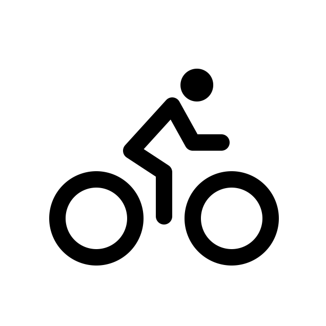

<p align="center">
  
</p>
<h1 align="center">
  Voyages à vélo
</h1>

## 🚀 Quick start

1.  **Start developing.**

    Navigate into your the site’s directory and start it up.

    ```shell
    cd bike-trips/
    yarn develop
    ```

2.  **Open the code and start customizing!**

    Your site is now running at http://localhost:8000!

2.  **Learn more**

    - [Documentation](https://www.gatsbyjs.com/docs/?utm_source=starter&utm_medium=readme&utm_campaign=minimal-starter-ts)
    - [Tutorials](https://www.gatsbyjs.com/docs/tutorial/?utm_source=starter&utm_medium=readme&utm_campaign=minimal-starter-ts)
    - [Guides](https://www.gatsbyjs.com/docs/how-to/?utm_source=starter&utm_medium=readme&utm_campaign=minimal-starter-ts)
    - [API Reference](https://www.gatsbyjs.com/docs/api-reference/?utm_source=starter&utm_medium=readme&utm_campaign=minimal-starter-ts)
    - [Plugin Library](https://www.gatsbyjs.com/plugins?utm_source=starter&utm_medium=readme&utm_campaign=minimal-starter-ts)
    - [Cheat Sheet](https://www.gatsbyjs.com/docs/cheat-sheet/?utm_source=starter&utm_medium=readme&utm_campaign=minimal-starter-ts)
